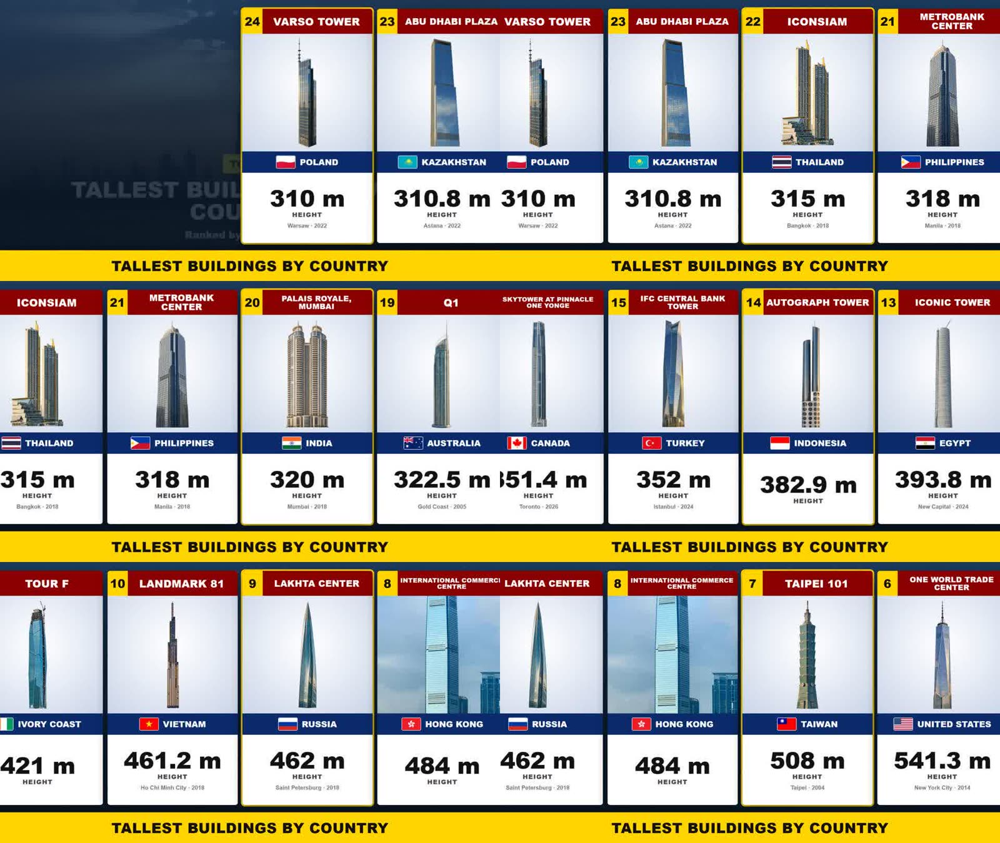
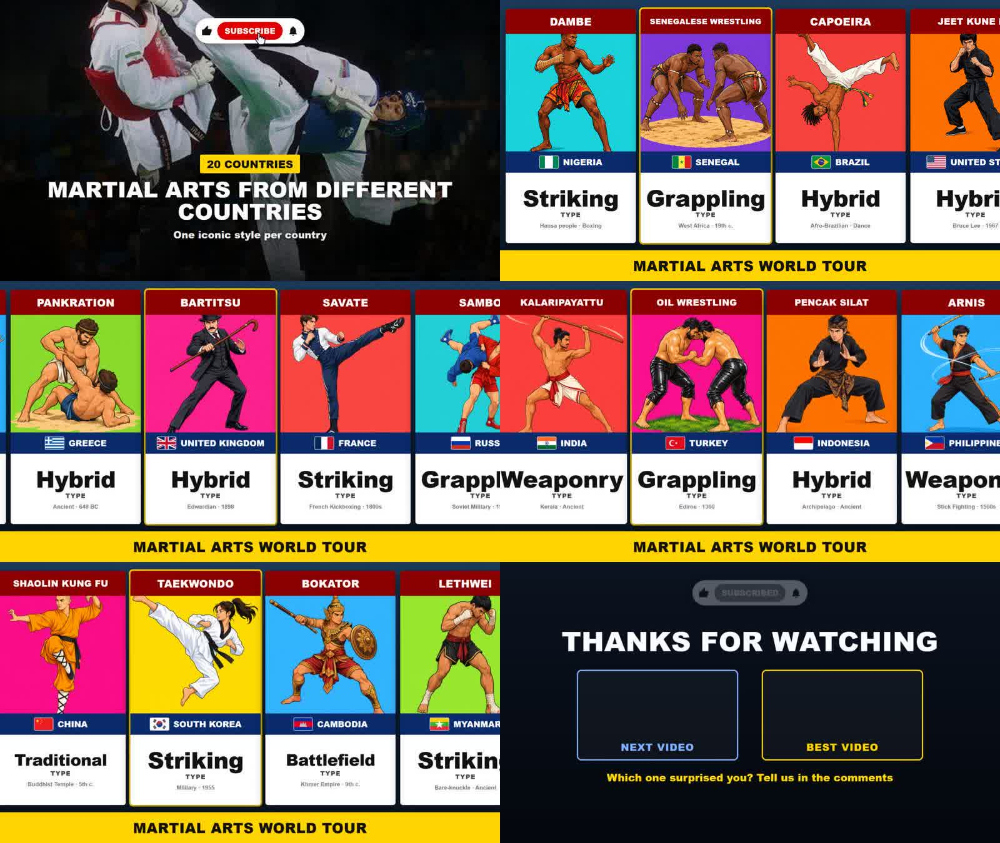
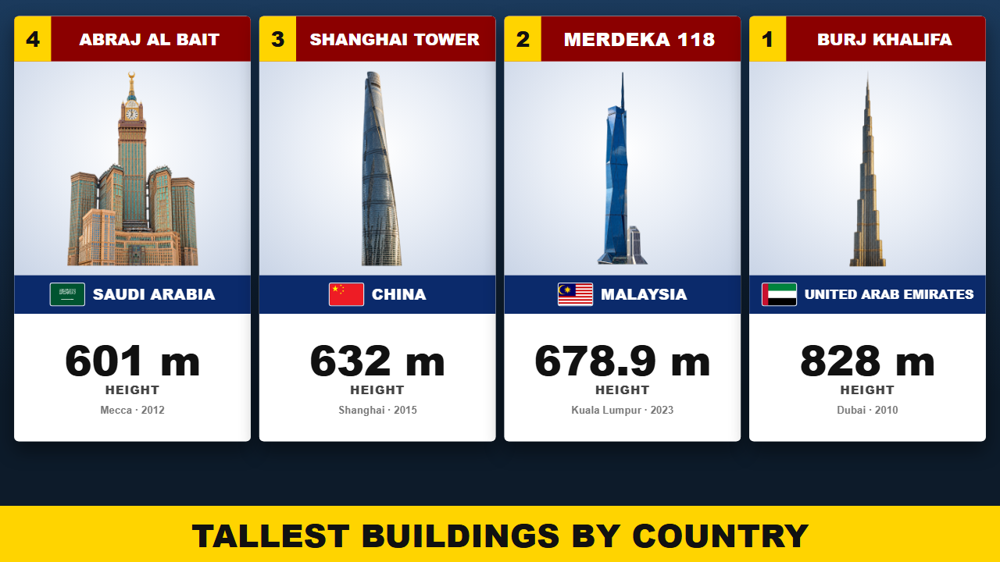
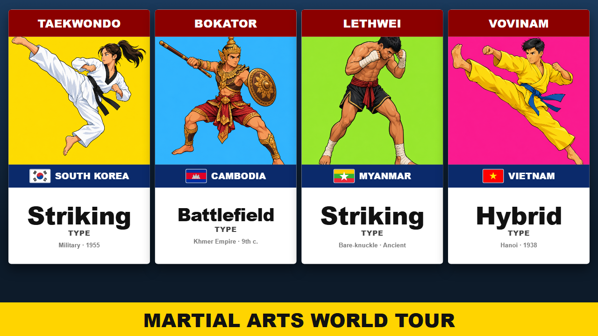
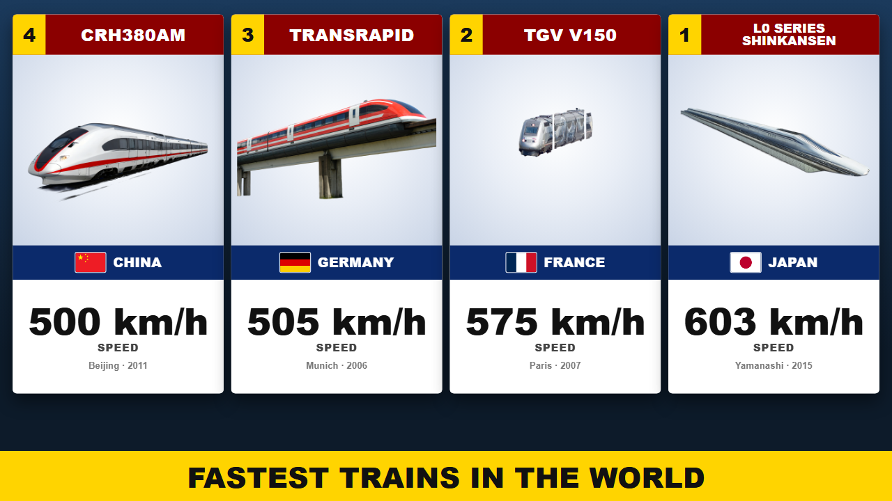

# Machine « Data Ranking » pour Agent OS

Une usine à vidéos YouTube **data / ranking** : les carrousels de cartes qui défilent en ordre croissant (« Tallest Building in Every Country », « 50 Richest Supermarkets », « Martial Arts From Different Countries »…), le format des chaînes List Data, Nerd Cassette, Aesthetic Data, okz data point, Rank India ou Country Cassette.

**Tu donnes un sujet et une durée. La machine rend la vidéo 1080p et tout le nécessaire pour la poster** : données vérifiées, voix off calée carte par carte, images, carrousel animé, miniature, titre, description avec chapitres et tags.




**Coût mesuré : environ 1,20 $ pour 5 minutes de vidéo** (images ~1 $, voix 0,14 $, musique 0,06 $, texte et contrôles ~0,01 $). Durée : 25 à 40 minutes de bout en bout, sans intervention en mode automatique.

---

## Ce que la machine fabrique

| Étape | Ce qui se passe |
|---|---|
| **Sujet** | Tu tapes un sujet en anglais, ou 💡 propose 6 idées inspirées des titres les plus vus de la niche (250 titres embarqués, ou ta propre banque de niche). |
| **Format** | La machine choisit seule : **classement croissant** (une valeur chiffrée par carte, compte à rebours jusqu'au n°1) ou **catalogue** (un élément par pays, tour du monde — le format le plus vu de la niche). |
| **Données** | Le code télécharge les tableaux des articles Wikipédia « List of… » du sujet ; Qwen construit la liste **à partir de ces tableaux** ; chaque valeur est recoupée avec **Wikidata** ; une relecture corrige, remplace, ajoute les oubliés et repère les homonymes. |
| **Script** | Intro (salut, sujet, teaser du n°1, abonnement), **une phrase par carte** à la formule de la niche (« [Nom] in [lieu] rises to [valeur], and [fait marquant] »), outro. Contrôle automatique + « script doctor ». |
| **Voix** | Inworld TTS, phrase par phrase : chaque carte arrive au centre de l'écran **au moment où sa phrase commence**. Le débit réel de la voix est mesuré et mémorisé : une vidéo demandée à 5 minutes dure 5 minutes (retrait ou ajout automatique de cartes). |
| **Images** | Drapeaux (flagcdn), portraits (photo Wikipédia — jamais d'IA pour une vraie personne), logos (Wikidata), lieux et objets **recréés en détourage par GPT Image 2.5** (ou Qwen Image 2.1) à partir de la photo Wikipédia, illustrations cartoon pour les catalogues. **Chaque image est contrôlée par Qwen** (fidélité, plausibilité, référence) et régénérée si besoin. |
| **Rendu** | Remotion : intro avec la photo du n°1 et bouton s'abonner animé, cartes qui entrent par la droite et défilent à vitesse constante, carte commentée surlignée, bandeau titre, musique Suno, écran de fin avec les emplacements des vignettes YouTube. Contrôle final par Qwen. |
| **Packaging** | Miniature au code de la niche (les 4 premières places + bandeau), titre, description avec **un chapitre par carte**, tags ≤ 500 caractères — puis Stock et publication YouTube (manuelle ou automatique). |



| Classement | Catalogue | Objets |
|---|---|---|
|  |  |  |

Tout est **reprenable** : un run interrompu repart là où il s'est arrêté, chaque étape se relance seule, chaque image se régénère individuellement.

---

## Installation (2 minutes)

**Le plus simple : donne ce dépôt à ton LLM** (Claude Code, Codex, Cursor…) avec cette phrase :

> Installe la machine Data Ranking dans mon Agent OS en suivant le fichier INSTALL-LLM.md de ce dépôt : https://github.com/Alex-sia99/datarank-machine

**À la main :**

```bash
git clone https://github.com/Alex-sia99/datarank-machine
cd datarank-machine
node install.js /chemin/vers/ton-agent-os     # le dossier qui contient agent-os/ et remotion/
                                             # ajoute --dry pour simuler sans rien écrire
```

L'installateur copie les fichiers puis pose lui-même les branchements dans `server.js`, `index.html`, `core.js`, `machines.js` et `Root.tsx`. Il est **idempotent** (relançable sans rien dupliquer), garde une sauvegarde `.bak-datarank` de chaque fichier modifié, et liste les rares branchements à faire à la main si ton Agent OS diffère.

### Ensuite

1. **Coffre d'Agent OS** : `openrouter` (Qwen), `kie` (images + musique), `fal` (voix Inworld). Chaîne YouTube connectée si tu veux publier depuis la machine.
2. `cd remotion && npx remotion compositions` → `DataCarousel` et `DataThumb` doivent apparaître.
3. Redémarre Agent OS → **Machines → 📊 Data Ranking** → un sujet, la durée → **⚙ Générer**.

**Prérequis** : Agent OS fonctionnel, Node 18+, FFmpeg dans le PATH, projet Remotion 4 opérationnel. **Aucune dépendance npm ajoutée.**

---

## Utilisation

**Onglet ⚙ Générer** — sujet (💡 pour des idées), durée, voix (avec son débit mesuré), modèle d'image, volume de la musique, musique oui/non, mode semi-manuel ou 100 % auto, publication automatique (chaîne + confidentialité, privée par défaut). Le prix estimé s'affiche avant de lancer.

**Mode semi-manuel** — la machine s'arrête après **Données**, **Script** et **Images** : tu relis, tu modifies une phrase, tu régénères une image avec une consigne, puis **✓ Valider**.

**🏁 Fini** — miniature (bandeau modifiable, recomposé gratuitement), titre + variantes, description avec chapitres, tags : 📋 copier, ↻💡 régénérer (avec une consigne), 💾 enregistrer, 📤 publier.

**Onglets Runs / Stock / Paramètres** — comme les autres machines : suivi, ⚡ reprise, 🛑 annulation, vidéos prêtes à poster, chiffres de la niche, couleurs des cartes, voix et musique par défaut, langue de la chaîne.

**En ligne de commande :**

```bash
cd agent-os
node scripts/datarank.js --topic "Tallest Building in Every Country" --duration 300 --voice Craig --image gpt25
node scripts/datarank.js --run <id> --reset assets        # refaire une étape (data|script|voice|assets|render|qa|package)
```

---

## Construire ta propre banque de niche (facultatif)

La machine est livrée avec l'analyse de 10 chaînes de référence (la recette chiffrée est dans [`RECETTE-NICHE-DATARANK.md`](files/agent-os/docs/RECETTE-NICHE-DATARANK.md)). Pour analyser tes propres chaînes :

```bash
cd agent-os
node scripts/niche-lab.js --niche "Data Ranking" --deep 10 --min 90 https://youtube.com/@Chaine1 @Chaine2 …
node scripts/carousel-lab.js --niche "Data Ranking"          # mise en page, vitesse, gabarit de voix off
node scripts/carousel-lab.js --digest                         # l'agrégat
```

Le Labo liste toutes les vidéos (API Data YouTube), télécharge les plus vues en 480p (yt-dlp, client `android`), en extrait une image toutes les 2 s et les fait analyser par Qwen. **Coût : environ 1,30 $ pour 95 vidéos.** Il faut `yt-dlp` dans le PATH et une clé YouTube Data dans le coffre.

---

## Contenu du dépôt

```
files/agent-os/lib/machines/datarank.js        le moteur (données, script, voix, images, rendu, packaging, stock, publication)
files/agent-os/lib/machines/datarank-niche.json 250 titres publics de la niche (inspiration du bouton 💡)
files/agent-os/lib/lab.js                      Labo de niche (scan de chaînes + analyse image par image)
files/agent-os/public/js/pages/datarank.js     l'interface (Générer, Runs, Stock, Paramètres + wizard)
files/agent-os/scripts/datarank.js             la machine en ligne de commande
files/agent-os/scripts/niche-lab.js            le Labo en ligne de commande
files/agent-os/scripts/carousel-lab.js         l'analyse dédiée « carrousel »
files/agent-os/docs/RECETTE-NICHE-DATARANK.md  la recette de la niche, chiffrée
files/remotion/src/DataCarousel.tsx            le carrousel + la miniature (compositions DataCarousel, DataThumb)
if-missing/agent-os/lib/llm.js                 client Qwen/OpenRouter — copié seulement si ton OS ne l'a pas
server-routes.snippet.js                       le bloc de routes, pour une installation à la main
install.js                                     l'installateur
INSTALL-LLM.md                                 le guide d'installation pour ton LLM
```

La machine s'appuie sur le socle d'Agent OS, non dupliqué ici : `store`, `vault`, `fal`, `spend`, `tasks`, `claude` (indispensables), `google` (publication), `bank`, `scrap`, `youtube`, `apify` (Labo de niche).

## Services utilisés

| Service | Rôle | Accès |
|---|---|---|
| Wikipédia / Wikidata | tableaux de données, vérification des valeurs, photos, logos | API publiques gratuites, sans clé |
| flagcdn.com | drapeaux | gratuit, sans clé |
| OpenRouter (Qwen 3.7 Plus / Flash) | données, script, SEO, contrôle des images | clé `openrouter` |
| Kie.ai | GPT Image 2.5 / Qwen Image 2.1, musique Suno | clé `kie` |
| FAL.ai | voix Inworld TTS | clé `fal` |
| YouTube | publication (facultatif), Labo de niche | OAuth Google + clé YouTube Data |

Wikipédia demande un User-Agent identifiable : tu peux mettre ton contact dans la variable d'environnement `WIKI_CONTACT` (e-mail ou URL).
